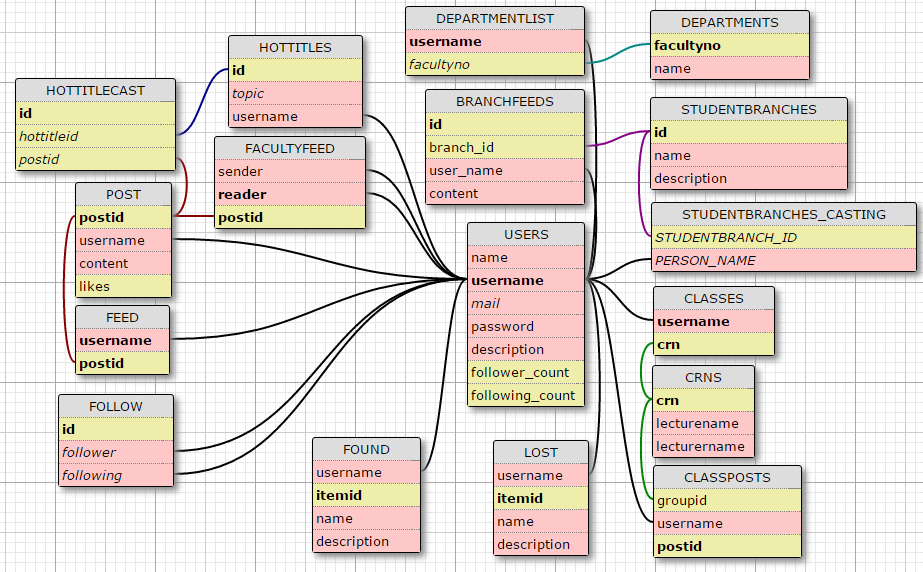

Developer Guide
===============

Database Design
---------------

This is our database design. You can see all of the tables in our database, their attributes and connections between tables.

     This is the all tables in the database of beeHive

Entity Distribution
^^^^^^^^^^^^^^^^^^^

:Mertcan Yasakçı:

   * USERS
   * LOST
   * FOUND

:İsmail Salih Namdar:

   * POST
   * FEED
   * FOLLOW
   * HOTTITLES
   * HOTTITLESCAST

:Pelin Hakverir:

   * CRNS
   * CLASSES
   * CLASSPOSTS

:Yunus Emre Pala:

   * STUDENTBRANCHES
   * STUDENTBRANCHES_CASTING
   * BRANCHFEEDS

:Berkan Öztekin:

   * DEPARTMENTS
   * DEPARTMENTLIST
   * FACULTYFEED

Code
----

.. toctree::

   member1
   member2
   member3
   member4
   member5
