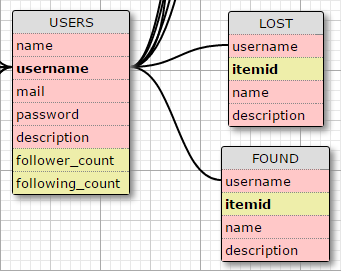
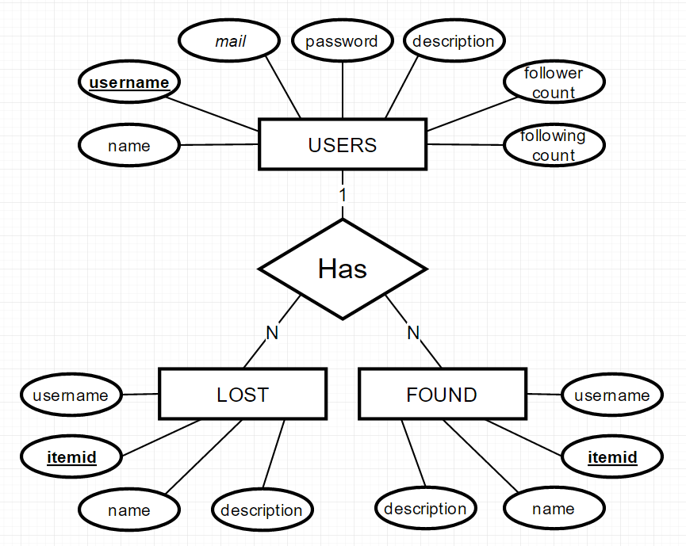
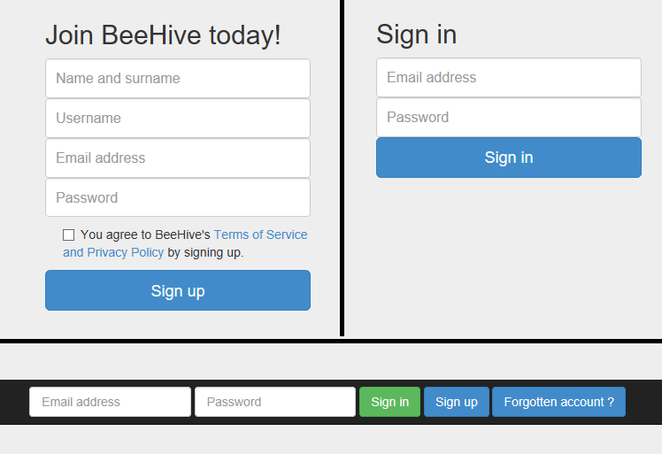
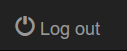

Parts Implemented by Mertcan Yasakçı
====================================

You can see the tables implemented by Mertcan Yasakçı below.

     This is the tables that implemented by Mertcan Yasakçı

There is also an E/R diagram for them.

     This is the E/R diagram for the tables that implemented by Mertcan Yasakçı

Login System
------------

For a login management system, **flask_login** is used.

.. code-block:: python

   from flask_login import LoginManager
   from flask_login.utils import login_required, login_user, current_user, logout_user

login_required used to prevent unauthorized access to pages.
login_user and logout_user used to handle user logins and logouts.
current_user is determined according to login_user and logout_user utilities.

     Forms in login pages

     Logout button can be found in the navbar after you logged in

USERS Table
-----------

USERS table holds informations for users such as their username, name, password, e-mail and so on.
You can see all colums of the USERS table and their types in the table create code below.

.. code-block:: sql

   CREATE TABLE USERS (
      NAME VARCHAR(80) NOT NULL,
      USERNAME VARCHAR(20) PRIMARY KEY,
      MAIL VARCHAR(80) NOT NULL UNIQUE,
      PASSWORD VARCHAR(120) NOT NULL,
      DESCRIPTION VARCHAR(100) DEFAULT 'No information given.',
      FOLLOWER_COUNT INTEGER DEFAULT 0,
      FOLLOWING_COUNT INTEGER DEFAULT 0)

There is also a user class for connection between the database and the login system. You can see the corresponding class decleration below.

.. code-block:: python

   class User(UserMixin):
      def __init__(self, fullName, userName, eMail, password, description, follower_count, following_count):
         self.fullName = fullName
         self.userName = userName
         self.email = eMail
         self.password = password
         self.description = description
         self.follower_count = follower_count
         self.following_count = following_count
         self.active = True
      def get_id(self):
         return self.userName
      @property
      def is_active(self):
         return self.active

Every user that registered to beeHive is added as a row to USERS table. In the **signup page**, a new user is created with the supplied informations and added to the table.
You can see the corresponding query below.

.. code-block:: sql

   INSERT INTO USERS (NAME, USERNAME, MAIL, PASSWORD) VALUES (%s, %s, %s, %s)

Values are taken from user and inserted into their places.

You can see and use other operations for USERS table in the **settings page**. In this page you can execute delete, update and search operations.
Following codes are queries that used for delete, update and search operations respectively.

.. code-block:: sql

   DELETE FROM USERS WHERE ( USERNAME=%s )

   UPDATE USERS SET NAME=%s, MAIL=%s, PASSWORD=%s WHERE ( USERNAME=%s )

   SELECT * FROM USERS WHERE ( USERNAME=%s )

However, in the application update query is constructed part by part since a user does not have to update all of his or her information. User can update just one part of his or her information.
Username part is taken from **current_user** variable which is provided by **flask_login**.

LOST Table
----------

LOST table holds informations for lost items. You can see all colums of the LOST table and their types in the table create code below.

.. code-block:: sql

   CREATE TABLE LOST (
      USERNAME VARCHAR (20) REFERENCES USERS ON DELETE CASCADE,
      ITEMID SERIAL PRIMARY KEY,
      NAME VARCHAR(80) NOT NULL,
      DESCRIPTION VARCHAR(80) NOT NULL)

Operations for the LOST table can be executed in the **lost and found page**. Queries used for create, update, delete and read operations can be seen below.

.. code-block:: sql

   INSERT INTO LOST (USERNAME, NAME, DESCRIPTION) VALUES (%s, %s, %s)

   DELETE FROM LOST WHERE ( USERNAME=%s AND ITEMID=%s )

   UPDATE LOST SET NAME=%s, DESCRIPTION=%s WHERE ( USERNAME=%s AND ITEMID=%s )

   SELECT * FROM LOST WHERE( USERNAME = %s )

Username is taken from **current_user** variable which is provided by **flask_login**. Also other fields are taken from the form that user filled to execute desired operation.

FOUND Table
-----------

FOUND table holds informations for found items. You can see all colums of the FOUND table and their types in the table create code below.

.. code-block:: sql

   CREATE TABLE FOUND (
      USERNAME VARCHAR (20) REFERENCES USERS ON DELETE CASCADE,
      ITEMID SERIAL PRIMARY KEY,
      NAME VARCHAR(80) NOT NULL,
      DESCRIPTION VARCHAR(80) NOT NULL)

Operations for the FOUND table can be executed in the **lost and found page**. Queries used for create, update, delete and read operations can be seen below.

.. code-block:: sql

   INSERT INTO FOUND (USERNAME, NAME, DESCRIPTION) VALUES (%s, %s, %s)

   DELETE FROM FOUND WHERE ( USERNAME=%s AND ITEMID=%s )

   UPDATE FOUND SET NAME=%s, DESCRIPTION=%s WHERE ( USERNAME=%s AND ITEMID=%s )

   SELECT * FROM FOUND WHERE( USERNAME = %s )

Username is taken from **current_user** variable which is provided by **flask_login**. Also other fields are taken from the form that user filled to execute desired operation.

Settings Page
-------------

This is the page where users can use delete, update and search operations for USERS table.
Feedback message after an operation sent to the page.
You can see the render functions that sends the appropriate messages to HTML file and part of the HTML file that visualizes the message.

.. code-block:: python

   return render_template('settings_page.html', messageU="Updated user %s" %(username))

.. code-block:: html

   
      
{{ messageU }}

   

.. code-block:: python

   return render_template('settings_page.html', result=datas)

.. code-block:: html

   
      
For user: {{ result[0][1] }}

      
Name and surname: {{ result[0][0] }}

      
E-mail: {{ result[0][2] }}

   

Lost and Found Page
-------------------

This is the page where users can create, delete, update and view lost and found items.
You can see render functions that sends the appropriate messages to HTML file and part of the HTML file that visualizes the message.

.. code-block:: python

   return render_template('lost_found.html', lostitems=lostitems, userlostitems=userlostitems, founditems=founditems, userfounditems=userfounditems)

.. code-block:: html

   
      <dl>
      
         <dt>{{ item[2] }}</dt>
         <dd>{{ item[3] }}</dd>
      
      </dl>
   
      
No items found.

   

.. code-block:: html

   
      <dl>
      
         <dt>{{ item[2] }}</dt>
         <dd>{{ item[3] }}</dd>
      
      </dl>
   
      
No items found.

   

.. code-block:: html

   
      <dl>
      
         <dt><input type="radio" name="itemSelected" value="{{ item[1] }}" /> {{ item[2] }}</dt>
         <dd>{{ item[3] }}</dd>
      
      </dl>
   
      
You have no lost items.

   

.. code-block:: html

   
      <dl>
      
         <dt><input type="radio" name="itemSelected" value="{{ item[1] }}" /> {{ item[2] }}</dt>
         <dd>{{ item[3] }}</dd>
      
      </dl>
   
      
You have no found items.

   