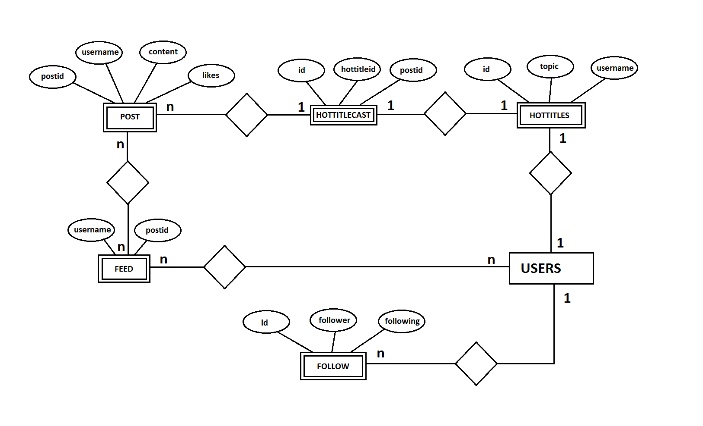

Parts Implemented by Ismail Salih Namdar
====================================
POST, FEED, HOTTITLES, HOTTITLECAST and FOLLOW tables are implemented by Ismail Salih Namdar. E/R diagram of those tables shown below.

	  E/R diagram of the given tables

POST Table
----------
**POST table** stores all the user's posts. Every post has unique "postid", "username" which is foreign key connected to USER table, "content" which has maximum 500 character and "likes".
Every post will be inserted to this table.

.. code-block:: sql

		CREATE TABLE POST (
			POSTID SERIAL PRIMARY KEY,
			USERNAME VARCHAR(20) REFERENCES USERS(USERNAME) ON DELETE CASCADE,
			CONTENT VARCHAR(500) NOT NULL,
			LIKES INT DEFAULT 0)

When user sends a post below operations will occure.

.. code-block:: python

		query = """INSERT INTO POST(USERNAME, CONTENT) VALUES(%s, %s)"""
		cursor.execute(query,(username, postContent))

		query = """SELECT POSTID FROM POST WHERE (USERNAME = %s and CONTENT = %s)"""
		cursor.execute(query,(username, postContent))
		postid = cursor.fetchall()

		query = """SELECT FOLLOWER FROM FOLLOW WHERE (FOLLOWING = %s)"""
		cursor.execute(query,(username,))
		followers = cursor.fetchall()

		query = """INSERT INTO FEED(USERNAME, POSTID) VALUES(%s, %s)"""
		cursor.execute(query,(username, postid[0]))

		for user in followers:
			query = """INSERT INTO FEED(USERNAME, POSTID) VALUES(%s, %s)"""
			cursor.execute(query,(user[0], postid[0]))

Firstly we will insert the given post to the **POST table**.

.. code-block:: python

		query = """INSERT INTO POST(USERNAME, CONTENT) VALUES(%s, %s)"""
		cursor.execute(query,(username, postContent))

Then we will take the inserted post's id from **POST table**

.. code-block:: python

		query = """SELECT POSTID FROM POST WHERE (USERNAME = %s and CONTENT = %s)"""
		cursor.execute(query,(username, postContent))
		postid = cursor.fetchall()

After that we will take the user's followers' username from **FOLLOW table**.

.. code-block:: python

		query = """SELECT FOLLOWER FROM FOLLOW WHERE (FOLLOWING = %s)"""
		cursor.execute(query,(username,))
		followers = cursor.fetchall()

Finally we will insert the post to **FEED table** of followers' and signed up user's

.. code-block:: python

		query = """INSERT INTO FEED(USERNAME, POSTID) VALUES(%s, %s)"""
		cursor.execute(query,(username, postid[0]))

		for user in followers:
			query = """INSERT INTO FEED(USERNAME, POSTID) VALUES(%s, %s)"""
			cursor.execute(query,(user[0], postid[0]))

When user wants to edit a specific post, he/she needs to click the post's blue button. After he/she clicks it post's id will be passed to **post_cfg** function.

.. code-block:: python
			
		@site.route('/post_cfg/<postid>', methods=['GET', 'POST'])
		def post_cfg(postid):
		
After taking specific id, below codes will be executed according to user.

.. code-block:: python
			
		query = """UPDATE POST SET CONTENT= %s WHERE (POSTID= %s)"""
		
		query = """DELETE FROM POST WHERE (POSTID= %s)"""

		query = """SELECT * FROM POST WHERE CONTENT = %s"""
		

FEED Table
----------
What is **FEED table**? **FEED table** represents the user's timeline. Table has two variable: first one is "username" and second one is "postid".
Those variables refer to the corresponding table's primary keys. By doing that we can store the posts with users who is not creator of those post.
They can only see the posts in the profile page. When a user sends a post it will be also inserted to all the followers' **FEED table** including his.
If posts wanted to be in the profile page, they need to be inserted to **FEED table**.

.. code-block:: sql

		CREATE TABLE FEED (
			USERNAME VARCHAR(20) REFERENCES USERS(USERNAME) ON DELETE CASCADE,
			POSTID INTEGER REFERENCES POST(POSTID) ON DELETE CASCADE ,
			PRIMARY KEY(USERNAME, POSTID))
			
As mentioned before, every post will insert user and user's followers is **FEED table**. If post is deleted from **POST table**. It will also be deleted in **FEED table**.

.. code-block:: python

		query = """INSERT INTO FEED(USERNAME, POSTID) VALUES(%s, %s)"""
		cursor.execute(query,(username, postid[0]))

		for user in followers:
			query = """INSERT INTO FEED(USERNAME, POSTID) VALUES(%s, %s)"""
			cursor.execute(query,(user[0], postid[0]))

Below query will be called when user is in the profile page. With this timeline will be created.

.. code-block:: python

		query = """SELECT POSTID FROM FEED WHERE USERNAME = %s ORDER BY POSTID DESC"""			

HOTTITLES and HOTTITLECAST Table
--------------------------------
Hot Titles is similar to hashtags in other social media applications. It has a topic, creator's username and id as a primary key. Topic needs to be unique.
Table can be shown below.

.. code-block:: sql

		CREATE TABLE HOTTITLES (
			ID SERIAL PRIMARY KEY,
			TOPIC VARCHAR(20) NOT NULL,
			USERNAME VARCHAR(20) REFERENCES USERS(USERNAME),
			UNIQUE(TOPIC))

When user wants to edit his/her own title, he/she needs to click it's link from profile page. 
After clicking it, **title_cfg** function will be called with variable which is title's id 

.. code-block:: python

		@app.route('/titles/<titleid>', methods=['GET', 'POST'])
		def title_cfg(titleid):
			
Below codes represents insert, update and delete operations. Those will be called according to user.

.. code-block:: python
		
		query = """INSERT INTO HOTTITLES(TOPIC, USERNAME) VALUES(%s, %s)"""
		
		query = """UPDATE HOTTITLES SET TOPIC = %s WHERE ID = %s"""

		query = """DELETE FROM HOTTITLECAST WHERE HOTTITLEID = %s"""

		query = """DELETE FROM HOTTITLES WHERE ID = %s"""
				
We have also **HOTTITLECAST table** which casts titles with posts. By doing that, we can reach specific title's posts. Table can be shown below.
HOTTITLEID and POSTID needs to be unique in order to avoid dublicate posts and errors. ID is a primary key of a table but it is not used.
It can be used in further updates.

.. code-block:: sql

		CREATE TABLE HOTTITLECAST (
			ID SERIAL PRIMARY KEY,
			HOTTITLEID INTEGER REFERENCES HOTTITLES(ID),
			POSTID INTEGER REFERENCES POST(POSTID) ON DELETE CASCADE,
			UNIQUE(HOTTITLEID, POSTID) )

Also we can send a post in the hot title page.
This post will be inserted in the **POST table** ,then owner's **FEED table** and **HOTTITLECAST table**. Relative codes can be shown below.

.. code-block:: python

		query = """INSERT INTO POST(USERNAME, CONTENT) VALUES(%s, %s)"""
		cursor.execute(query,(username, postContent))

		query = """SELECT POSTID FROM POST WHERE (USERNAME = %s and CONTENT = %s)"""
		cursor.execute(query,(username, postContent))

		postid = cursor.fetchall()

		query = """INSERT INTO FEED(USERNAME, POSTID) VALUES(%s, %s)"""
		cursor.execute(query,(username, postid[0][0]))

		query = """INSERT INTO HOTTITLECAST(HOTTITLEID, POSTID) VALUES(%s, %s)"""
		cursor.execute(query,(titleid[0], postid[0][0]))

FOLLOW Table
------------
**Follow table** connects follower with following. ID is a primary key of a table but it is not used.
It can be used in further updates.
Table can be shown below.

.. code-block:: sql

		CREATE TABLE FOLLOW (
			ID SERIAL PRIMARY KEY,
			FOLLOWER VARCHAR(20) REFERENCES USERS(USERNAME),
			FOLLOWING VARCHAR(20) REFERENCES USERS(USERNAME),
			UNIQUE(FOLLOWER, FOLLOWING))
			
Above codes is represent follow method.

.. code-block:: python
		username = request.form['foundUser']
		flag = False
		if current_user.userName == username:
			message = "Follow yourself but only in real life :)"
			return render_template('search.html', message = message)

		with dbapi2.connect(flask.current_app.config['dsn']) as connection:
			cursor = connection.cursor()

			query = """SELECT * FROM FOLLOW WHERE FOLLOWER = %s AND FOLLOWING = %s"""
			cursor.execute(query, (current_user.userName, username,))

			result = cursor.fetchall()

			if result:
				return render_template('search.html', message = "User couldn't added to following list. Possible reason: User is already in the list.")

			else:
				query = """INSERT INTO FOLLOW(FOLLOWER, FOLLOWING) VALUES(%s, %s)"""
				cursor.execute(query, (current_user.userName, username,))
				query = """UPDATE USERS SET FOLLOWER_COUNT = (FOLLOWER_COUNT+1) WHERE USERNAME = %s"""
				cursor.execute(query, (username,))
				query = """UPDATE USERS SET FOLLOWING_COUNT = (FOLLOWING_COUNT+1) WHERE USERNAME = %s"""
				cursor.execute(query, (current_user.userName,))
				connection.commit()
				return render_template('search.html', message = "User added to following list.")

Let's divide the below code. First if user try to follow himself/herself error message will appear.

.. code-block:: python

		if current_user.userName == username:
			message = "Follow yourself but only in real life :)"
			return render_template('search.html', message = message)

If user tries to follow user that already followed, an error message will be displayed.

.. code-block:: python

		query = """SELECT * FROM FOLLOW WHERE FOLLOWER = %s AND FOLLOWING = %s"""
		cursor.execute(query, (current_user.userName, username,))

		result = cursor.fetchall()

		if result:
			return render_template('search.html', message = "User couldn't added to following list. Possible reason: User is already in the list.")

Else, user will follow the selected user. Both user will be inserted the **FOLLOW table**. Signed up user's **following_count** will be incremented as well as following user's **follower_count**.

.. code-block:: python

		else:
				query = """INSERT INTO FOLLOW(FOLLOWER, FOLLOWING) VALUES(%s, %s)"""
				cursor.execute(query, (current_user.userName, username,))
				query = """UPDATE USERS SET FOLLOWER_COUNT = (FOLLOWER_COUNT+1) WHERE USERNAME = %s"""
				cursor.execute(query, (username,))
				query = """UPDATE USERS SET FOLLOWING_COUNT = (FOLLOWING_COUNT+1) WHERE USERNAME = %s"""
				cursor.execute(query, (current_user.userName,))
				connection.commit()
				return render_template('search.html', message = "User added to following list.")
		