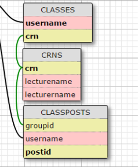
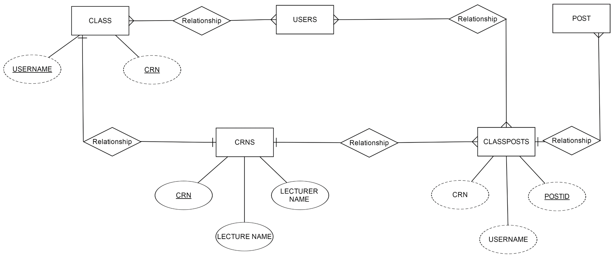

Parts Implemented by Pelin Hakverir
===================================
You can see the tables implemented by Pelin Hakverir below.

     The tables which are implemented by Pelin Hakverir

The relations of these tables with other and each other are shown in th E/R diagram below.

     E/R diagram of the relations of the tables implemented by Pelin Hakverir

CRNS TABLE
----------
CRNS table stores all the lectures and their detailed informations like CRN of the lecture, lecture's name, lecturer's name. CRN information is the primary key value and it shoud not be null because of that. Also lecture's name should not be null either because that a class has to have a name. Lecturer's name is not have to be filled because sometimes students can forget their names.

.. code-block:: python

                  CREATE TABLE CRNS (
                    CRN INTEGER PRIMARY KEY NOT NULL,
                    LECTURENAME VARCHAR(150) NOT NULL,
                    LECTURERNAME VARCHAR(50))

When a lecture is added to CRNS table, firstly the CRN information is checked. If it already exists in the table, an error message is shown. If not, the lecture is added to the table.

.. code-block:: python

                query = """SELECT * FROM CRNS WHERE CRN = %s """
                cursor.execute(query,[crn])
                result = cursor.fetchall()

                if len(result) == 1:
                    textMessage = 'The CRN information is already registered'

                else:
                    lectureName=request.form['lecture']
                    lecturerName=request.form['lecturer']
                    query = """INSERT INTO CRNS (CRN, LECTURENAME, LECTURERNAME) VALUES (%s, %s,%s)"""
                    cursor.execute(query,(crn, lectureName, lecturerName))
                    textMessage = 'Lecture is successfully added to current lectures'

When deleting a lecture, firstly the given CRN information is searched in the table. If it does not exist in the table, means that there is no lecture to be deleted with that CRN, an error message is shown to the user. If the CRN information is in the table, the students in that class are checked. If there are students who are registered to that class, the lecture cannot be deleted and an error message is shown. If there are no students in that class, the lecture is deleted.

.. code-block:: python

                query = """SELECT * FROM CRNS WHERE CRN = %s """
                cursor.execute(query,[delete])
                result = cursor.fetchall()

                if len(result) ==0:
                    textMessage = 'The CRN information is not registered yet'
                else:
                    query = """SELECT USERNAME FROM CLASSES WHERE CRN = %s """
                    cursor.execute(query,[delete])
                    result = cursor.fetchall()

                    if len(result) ==0:
                        query = """DELETE FROM CRNS WHERE (CRN=%s)"""
                        cursor.execute(query,[delete])
                        textMessage = 'Lecture is successfully deleted'
                    else:
                        textMessage = 'There are student(s) who are registered for the class!'

When updating a lecture's informations, firstly the CRN is searched in the table again. If it does not exist in the table, an error message is shown to the user. If it does, the lecture name and lecturer name informations are updated with the new ones.

.. code-block:: python

                query = """SELECT * FROM CRNS WHERE CRN = %s """
                cursor.execute(query,[update])
                result = cursor.fetchall()

                if len(result) ==0:
                    textMessage = 'The CRN information is not registered yet'
                else:
                    lecturename=request.form['nlecture']
                    lecturername=request.form['nlecturer']
                    query = """UPDATE CRNS SET LECTURENAME=%s WHERE CRN=%s"""
                    cursor.execute(query,(lecturename, update))
                    query = """UPDATE CRNS SET LECTURERNAME=%s WHERE CRN=%s"""
                    cursor.execute(query,(lecturername, update))
                    textMessage = 'Lecture information is successfully updated'

When searching lectures, there are two options.

To search a specific lecture, firstly the CRN is searched in the table again. If it does not exist in the table, an error message is shown to the user. If it does, the lecture's all informations, CRN&lecture name&lecturer name, are written on the page.

.. code-block:: python

                query = """SELECT * FROM CRNS WHERE CRN = %s """
                cursor.execute(query,[crn])
                result = cursor.fetchall()

                if len(result) ==0:
                    textMessage = "The CRN information is not in the database"
                else:
                    query = """SELECT * FROM CRNS WHERE CRN=%s"""
                    cursor.execute(query, [crn])
                    lectures=cursor.fetchall()
                    return render_template('classes.html', user = current_user, lists=lectures, lectures=myCRNs)

To list all lectures, all informations of all lectures are taken from the table.

.. code-block:: python

                query = """SELECT * FROM CRNS"""
                cursor.execute(query)
                lectures=cursor.fetchall()
                textMessage = ''
                return render_template('classes.html', user = current_user, lists=lectures, lectures=myCRNs)

CLASSES TABLE
-------------
Classes table stores the information of which student takes which classes. CRN is the foreign key from CRNS table, USERNAME is foreign key from USERS table and they create the primary key together.

.. code-block:: python

                  CREATE TABLE CLASSES (
                    CRN INTEGER REFERENCES CRNS(CRN) ON DELETE CASCADE NOT NULL,
                    USERNAME VARCHAR (20) REFERENCES USERS ON DELETE CASCADE NOT NULL,
                    PRIMARY KEY(CRN, USERNAME))

To add a user to a class, firstly the given CRN is searched in the CRNS table. If it does not exist in the table, an error message is shown to the user. If it does, the username of the user and the given CRN are inserted into CLASSES table.

.. code-block:: python

                query = """SELECT * FROM CRNS WHERE CRN = %s """
                cursor.execute(query,[add])
                result = cursor.fetchall()
                if len(result) ==0:
                    textMessage = 'The CRN information is not in the database'
                else:
                    query = """INSERT INTO CLASSES (CRN, USERNAME) VALUES (%s, %s)"""
                    cursor.execute(query,(add, username))
                    textMessage = 'Have a good time in your new class!'

If a user wants to leave a class,firstly the given CRN is searched in the CRNS table. If it does not exist in the table, an error message is shown to the user. If it does, the row that has the information of the user's username and class is deleted from the CLASSES table. Be careful that the username is not deleted from USERS table thanks to its CASCADE property.

.. code-block:: python

                query = """SELECT * FROM CRNS WHERE CRN = %s """
                cursor.execute(query,[left])
                result = cursor.fetchall()

                if len(result) ==0:
                    textMessage = 'The CRN information is not in the database'
                else:
                    query = """DELETE FROM CLASSES WHERE (CRN=%s AND USERNAME=%s)"""
                    cursor.execute(query,(left, username))
                    textMessage = 'You successfully left the class'

If a user wants to update his/her class, firstly the given CRNs are searched in the CRNS table. Firstly, the CRN that is wanted to be changed is searched in the table. If it does not exist in the table, an error message is shown to the user. If it does, the CRN that wants to be added is searched in the CRNS table. If it does not exist in the table, an error message is shown to the user. If it does, the row that contains user's username and first CRN is found and first CRN is changed with second CRN.

.. code-block:: python

                oldcrn=request.form['oldCRN']

                query = """SELECT * FROM CRNS WHERE CRN = %s """
                cursor.execute(query,[oldcrn])
                result = cursor.fetchall()

                if len(result) ==0:
                    textMessage = 'The old CRN information is not in the database'
                else:
                    newcrn=request.form['newCRN']
                    query = """SELECT * FROM CRNS WHERE CRN = %s """
                    cursor.execute(query,[newcrn])
                    resultnew = cursor.fetchall()
                    if len(resultnew) == 0:
                        textMessage = 'The new CRN information is not in the database'
                    else:
                        query = """UPDATE CLASSES SET CRN=%s WHERE ((CRN=%s) AND (USERNAME=%s))"""
                        cursor.execute(query, (newcrn, oldcrn, username))
                        textMessage = 'Your current classes are successfully updated'

CLASSPOSTS TABLE
----------------
CLASSPOSTS table stores the group numbers which are CRNs, the posts' id's which are posted in that group and usernames who posted that post.

.. code-block:: python

                  CREATE TABLE POST (
                    POSTID SERIAL PRIMARY KEY,
                    USERNAME VARCHAR(20) REFERENCES USERS(USERNAME) ON DELETE CASCADE,
                    CONTENT VARCHAR(500) NOT NULL,
                    LIKES INT DEFAULT 0)

When sending a post, the content of the post and the username of the user who sent the post is inserted into POST table.
After that, username and content is used to find the postid in POST class.
Then, with the CRN information of the class which is taken from the group page, username and postid; the post information is stored in the CLASSPOSTS table.
Finally, by searching usernames which is registered to the current CRN (group) in the CLASSES table, the classmates of the user are also found and then the post is inserted into all of their FEED tables.

.. code-block:: python

                query = """INSERT INTO POST(USERNAME, CONTENT) VALUES(%s, %s)"""
                cursor.execute(query,(username, postContent))

                query = """SELECT POSTID FROM POST WHERE (USERNAME = %s and CONTENT = %s)"""
                cursor.execute(query,(username, postContent))
                postid = cursor.fetchall()

                query = """INSERT INTO CLASSPOSTS(GROUPID, USERNAME, POSTID) VALUES (%s, %s, %s)"""
                cursor.execute(query,(lectureid, username, postid[0][0]))

                query = """SELECT DISTINCT USERNAME FROM CLASSES WHERE CRN = %s"""
                cursor.execute(query,(lectureid[0]))
                classFriends = cursor.fetchall()

                for friend in classFriends:
                    query = """INSERT INTO FEED(USERNAME, POSTID) VALUES (%s, %s)"""
                    cursor.execute(query,(friend[0], postid))
                connection.commit()

When updating and deleting a post, the normal post settings page is used, but the background is different.

When updating a post, only the content in the POST table is updated.

.. code-block:: python

                query = """UPDATE POST SET CONTENT= %s WHERE (POSTID= %s)"""

                cursor.execute(query, (postContent, postid))

When deleting a post, firstly the post is searched in the CLASSPOSTS table. Because that we are trying to delete a post which is in a group, it will return 1. And then, firstly the post is deleted from the CLASSPOSTS table, then POST table.

.. code-block:: python

                query = """SELECT * FROM CLASSPOSTS WHERE POSTID = %s"""
                cursor.execute(query, [postid])
                result = cursor.fetchall()

                if len(result) ==0:
                    query = """DELETE FROM POST WHERE (POSTID= %s)"""
                    cursor.execute(query, [postid])
                else:
                    query = """DELETE FROM CLASSPOSTS WHERE (POSTID= %s)"""
                    cursor.execute(query, [postid])
                    query = """DELETE FROM POST WHERE (POSTID= %s)"""
                    cursor.execute(query, [postid])