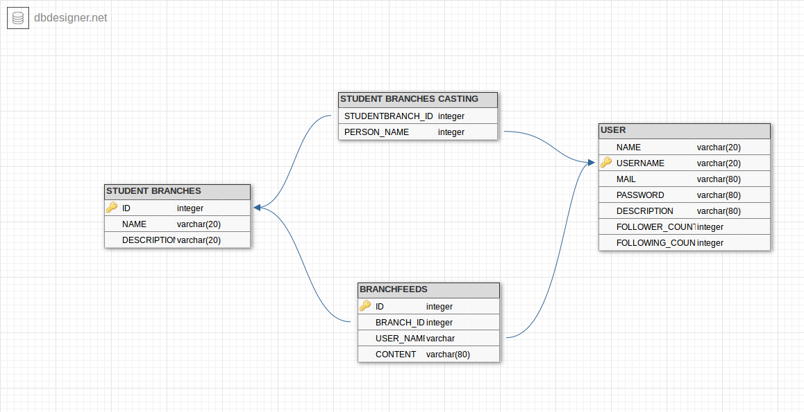

Parts Implemented by Yunus Emre Pala
====================================

There are listed tables that Yunus Emre added to database

	  Those tables added by Yunus Emre Pala and as you can see all related with student branches

Student branch
--------------

Management of student branch is done by beeHive admins(all operations manually) ,that page only visible for admins.

All related functions are under the branch_operations.py file to work with multiple files not to damage each others changes.
This could be done by using Blueprint.

So that server file should contain these lines(registering for Blueprint)

.. code-block:: python

	from branch_operations import site
	from flask import Blueprint
	def create_app():
    	app = Flask(__name__)
   		app.register_blueprint(site)
    	return app
		
and this is for branch_operations file

.. code-block:: python

	site = Blueprint('site', __name__,template_folder='templates', static_folder='static')

Table Initializations
---------------------

In initdb functions all necessary tables are initilizing including tables that related with branch tables.

.. code-block:: python

	query = """CREATE TABLE STUDENTBRANCHES(
                ID SERIAL PRIMARY KEY,
                NAME VARCHAR(20),
                DESCRIPTION VARCHAR(50)
    ) """
    cursor.execute(query)

    query = """INSERT INTO STUDENTBRANCHES(NAME, DESCRIPTION) VALUES ('COMPUTER SOCIETY','lorem ipsum lorem ipsum') """
    cursor.execute(query)

.. code-block:: python

    query = """CREATE TABLE STUDENTBRANCHES_CASTING(
                STUDENTBRANCH_ID INTEGER REFERENCES STUDENTBRANCHES(ID),
                PERSON_NAME VARCHAR(20) REFERENCES USERS(USERNAME) ON DELETE CASCADE,
                UNIQUE(STUDENTBRANCH_ID, PERSON_NAME)
    ) """
    cursor.execute(query)

    query = """INSERT INTO STUDENTBRANCHES_CASTING(STUDENTBRANCH_ID, PERSON_NAME) VALUES (1,'mcanyasakci') """
    cursor.execute(query)

.. code-block:: python

	query = """ 
        CREATE TABLE BRANCHFEEDS(
        ID SERIAL PRIMARY KEY, 
        BRANCH_ID INTEGER REFERENCES STUDENTBRANCHES(ID),
		USER_NAME VARCHAR(20) REFERENCES USERS(USERNAME),
		CONTENT VARCHAR(200) NOT NULL
		)
		"""
    cursor.execute(query)

    query = """ INSERT INTO
        BRANCHFEEDS (BRANCH_ID, USER_NAME,CONTENT) VALUES 
        (1,'namdar', 'This is awesome branch, keep in touch for news !!!') """
        cursor.execute(query)

To explain briefly each student branch has unique id, name, and short description.
STUDENTbranchES_CASTING table is standing for specify which users added to which branch , and of course a user might be registered for multiple branches or more than one user registered for a branch

BRANCHFEEDS table is storing posts for branches it has unique id for specify each posts on branches. and 2 foreign keys that decides who send post for which branch

Branch Methods
--------------
Here is some important points of branch methods implemented by Yunus Emre Pala

.. code-block:: python

	@site.route('/branch/<int:branchID>', methods =['GET','POST'])

both POST and GET methods are allowed to make dynamic website.
and by using '/branch/<int:branchID>' we don't need to impelement each branches page explicitly

.. code-block:: python

    with dbapi2.connect(flask.current_app.config['dsn']) as connection:
        cursor = connection.cursor()
        query = """SELECT * FROM STUDENTBRANCHES WHERE ID = %s """
        cursor.execute(query,(str(branchID),))

in here program connects to database check if there is a branch that specified in url
if does not exist

.. code-block:: python

	if len(results) == 0:
	    return render_template('show_branches.html',results = results) 

program sends empty list to html file  for branch informations 

.. code-block:: html

	
		<h2> There is no such a Student Branch</h2>
	

And in html file if there is no information about branch it shows proper message to user

In some pages program behaves user by considering wheter request comes from anonymous or user of site
to do this we are required to current_user of flask 

.. code-block:: python

	from flask_login.utils import login_required, login_user, current_user
