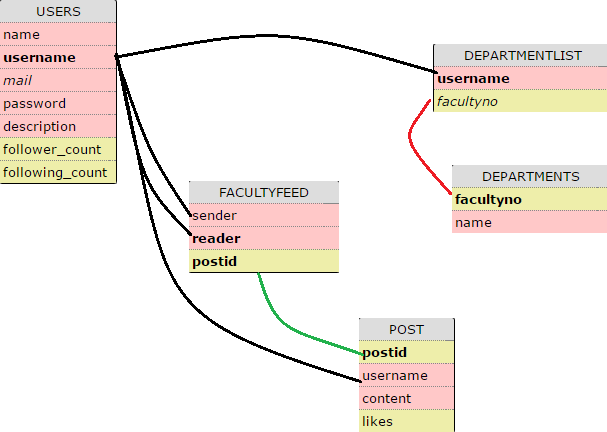
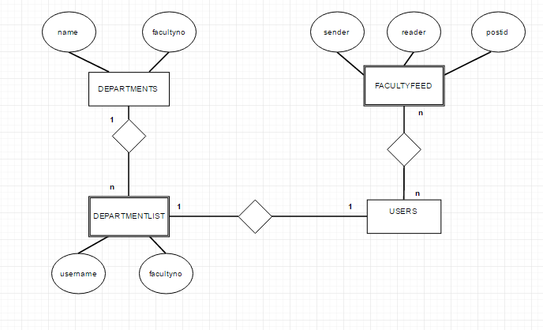
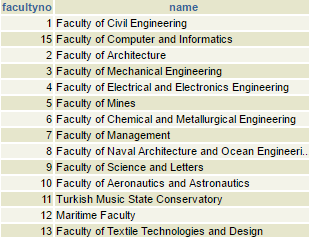
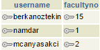
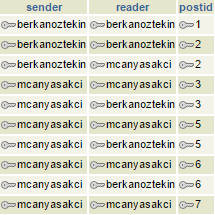

Parts Implemented by Berkan Öztekin
===================================
You can see the tables DEPARTMENTS, DEPARTMENTLIST and FACULTYFEED implemented by Berkan Öztekin below.

     This is the tables that implemented by Berkan Öztekin

and, E/R diagram can be seen below

     This is the E/R diagram for the tables that implemented by Berkan Öztekin

DEPARTMENTS Table
-----------------

Departments table hold the static data which are the name and no of faculties on ITU.

.. code-block:: sql

      CREATE TABLE DEPARTMENTS (
          FACULTYNO INTEGER PRIMARY KEY,
          NAME VARCHAR(80))

Contents of DEPARTMENTS table can be seen below

     How  DEPARTMENTS Table Looks Like

DEPARTMENTLIST Table
--------------------

DEPARTMENTLIST table holds the facultyno for the all users who chose their faculty. And facultyno (column) in this table is connected with facultyno(column) in  DEPARTMENTS table.

.. code-block:: sql

      CREATE TABLE FACULTYFEED (
          CREATE TABLE DEPARTMENTLIST (
          USERNAME VARCHAR(20) PRIMARY KEY REFERENCES USERS(USERNAME) ON DELETE CASCADE,
          FACULTYNO INTEGER REFERENCES DEPARTMENTS(FACULTYNO) ,
          UNIQUE (USERNAME , FACULTYNO) )

As we can see, username and facultyno are unique.This means, one user can have only one faculty.

     How Departmentlist Table Looks Like

Queries used for insert, update, select and delete operations can be seen below.

.. code-block:: sql

      INSERT INTO DEPARTMENTLIST (USERNAME, FACULTYNO ) VALUES (%s, %s)

      UPDATE DEPARTMENTLIST SET FACULTYNO=%s WHERE (USERNAME=%s)

      DELETE FROM DEPARTMENTLIST WHERE ( USERNAME=%s )

      SELECT D.NAME FROM DEPARTMENTS AS D INNER JOIN DEPARTMENTLIST AS L ON D.FACULTYNO =L.FACULTYNO  WHERE L.USERNAME = %s

For select the name of the faculty, we need to join 2 tables which are DEPARTMENTS and DEPARTMENTLIST, After join process, we can get a name of the faculty for specific user.

FACULTYFEED Table
-----------------

If the user send a post by using the text box in faculty page, this table will be affected. This table holds the username of sender, username of reader, and postid for the sent post.
And, this table is connected with both USERS Table, and POST Table.

.. code-block:: sql

      CREATE TABLE FACULTYFEED (
          SENDER VARCHAR(20) REFERENCES USERS(USERNAME) ON DELETE CASCADE,
          READER VARCHAR(20) REFERENCES USERS(USERNAME) ON DELETE CASCADE,
          POSTID INTEGER REFERENCES POST(POSTID) ON DELETE CASCADE ,
          PRIMARY KEY(READER, POSTID))

     How Facultyfeed Table Looks Like
