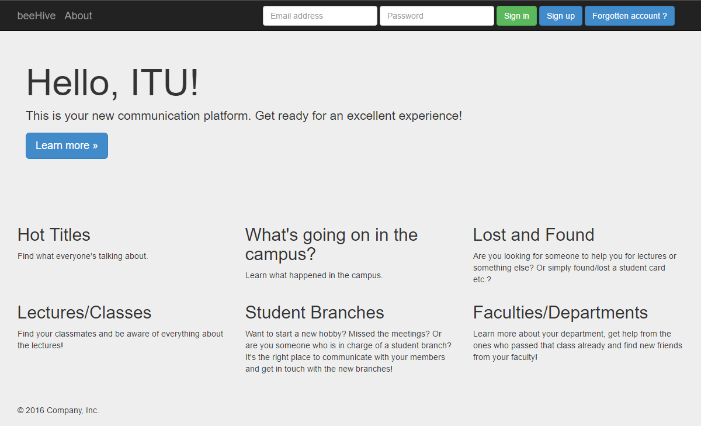

User Guide
==========

In this section we will be explaining mostly visual parts we implemented in our project.
You will be informed about our site. If you want to learn much more than that then we suggest you to look our developer guide.

     Landing page of beeHive

.. toctree::

   member1
   member2
   member3
   member4
   member5
