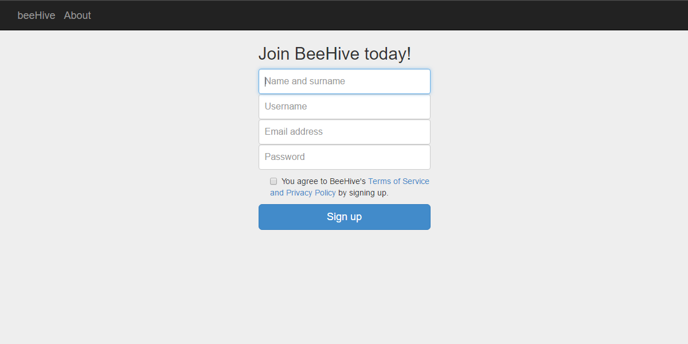
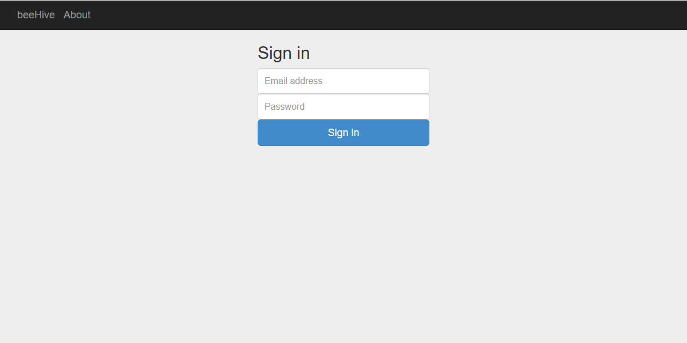
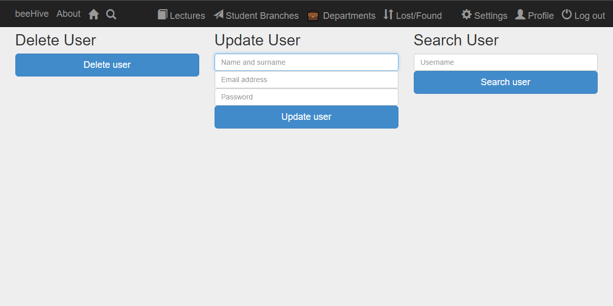
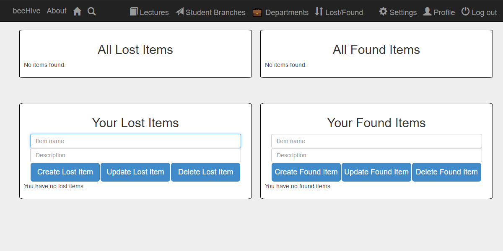

Parts Implemented by Mertcan Yasakçı
====================================
Signup, signin, settings and lost-found pages are created by Mertcan Yasakçı. As you can imagine all of these pages are mainly related to users. Also login management system for users is implemented by Mertcan Yasakçı using Flask-login.

Signup
------
You have to give all of the requested information in the signup page. These informations will be hold in a database for further applications. Also your username and e-mail must be unique in our database.
Which means you can not register to beeHive using two same e-mail addresses or two same usernames. You can see the signup page of beeHive below.

     Signup page for registering to beeHive

Signin
------
To access most of the beeHive's pages, you have to be logged in succesfully. If you try to access a page that requires an authorizatiton without being logged in, system redirects you to the signin page.
This implemented for preventing unauthorized access to our lovely beeHive. You can see the signin page of beeHive below.

     Signin page where you will be directed if you are not authorized

In that page if you signin with a valid user account, page will redirect you to the page you requested to see.

Settings
--------
This is the page that users can update their user informations, search other users with their username and delete their own user account from the beeHive.
Users do not have to fill all of the sections in the update option. If a user wants to update a spesific piece of information, it is enough to fill only the corresponding text box.
User's informations in the database will be updated and a message will be shown if operation is succesfull.

In the search section users can search other users with their usernames. If there is an existing user with the given username, some of the informations for the searched user will be shown to the searcher.

Lastly, in the delete section if a user wants to leave our lovely beeHive, he or she can click the button. The user will be logged out and removed from the databese. With logging out, user will be redirected to landing page.
You can see the settings page of beeHive below.

     Settings page where users can manage their accounts

Lost and Found
--------------
Have you find an item or lost one of the most precious items of you? Then this page is just for you!
In this page you can see all of the lost and found items by our users. Also you can add items you found or lost.
In the top section users can view all of the items that is found or lost. In the bottom section users can add new items, update existing items and delete them. Of course all of the operations users can do in bottom section can only affect their own items.
No one can change other users' items. You can see the lost and found page of beeHive below.

     Lost and found page where users can manage their items