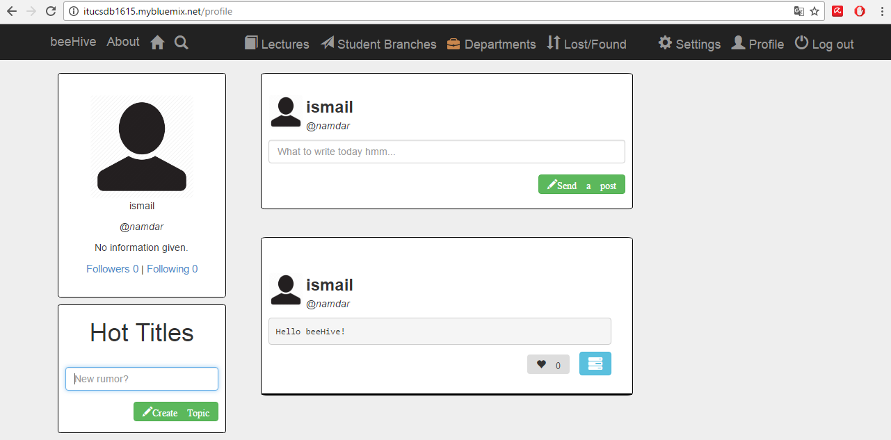
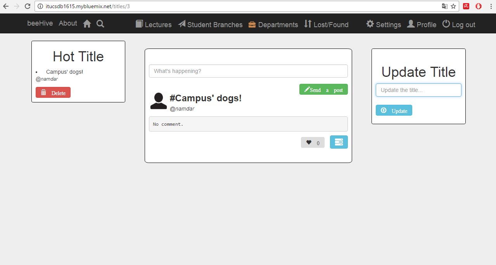
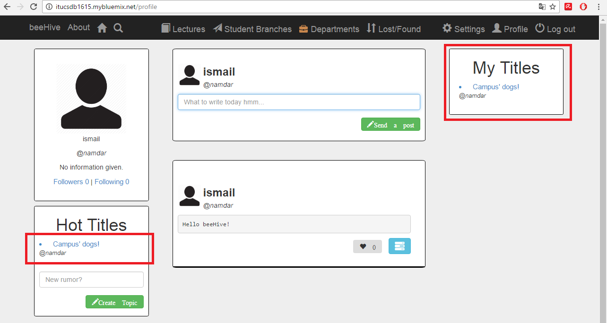
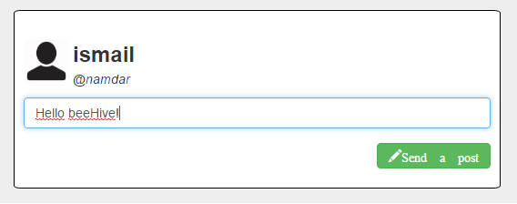
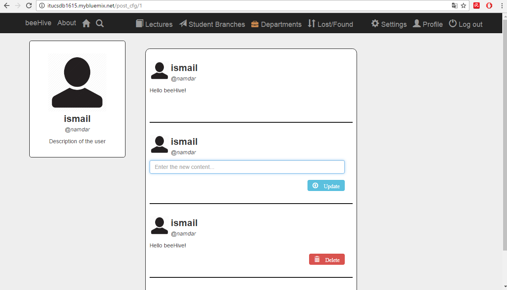
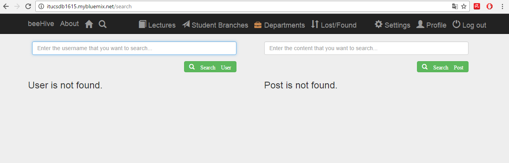
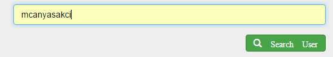
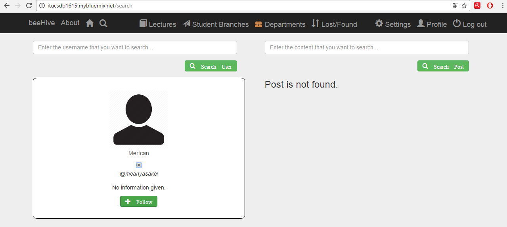
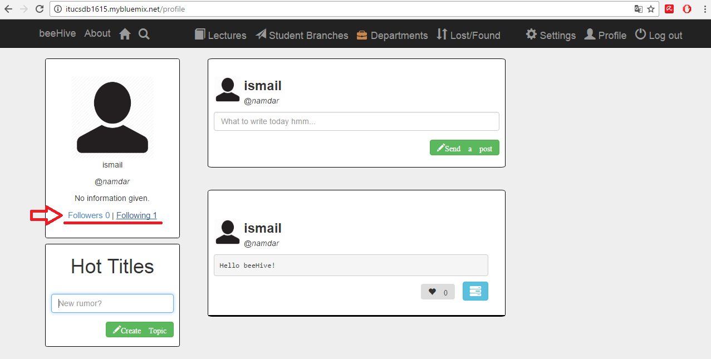
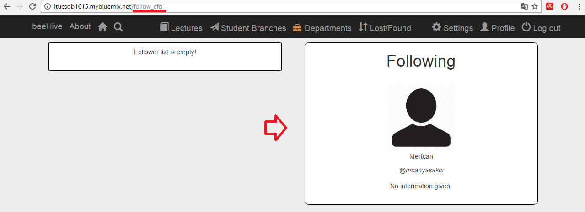

Parts Implemented by Ismail Salih Namdar
====================================
Profile, Hot Title, Post Configuration, Search and Follow pages are created by Ismail Salih Namdar. 

Profile Page/ Home Page
-----------------------
This is the home page with profile information of a signed up user. Profile information is located top left corner of the page. 
Signed up user can reach his/her information, hot titles and new posts with this page. User can also create a title or a post in this page.

	  Home page of a signed up user

Hot Title
---------
What is hot title? Hot title is mainly similar to hashtags in other social media applications. All users can see, reach and comment about the title.
Only title owner can edit the title.
		  

	  Example of a specific Hot Title's page
		  
In order to reach to above page user only needs to click it's link in the profile page.

	  Created Hot Title

Post Property
-------------
In order to send a post only thing user needs to do is go to the profile page and type in the box whatever user wants. Then he/she needs to click the "Send a Post" button.

	  Sending post example
	  
Sending post using profile page will ensure that all the followers will recieve that post also.

	  Home page of a signed up user
	  
Moreover, by using blue button which is located bottom right corner of the post users can edit his/her post. Posts that is not owned by the logged in user can not be changed.

	  Post Properties

User can delete or update his/her post in the above page.

Searching
---------
By using search icon in the navigation bar, users can search for a post or a user. In order to search for a different user, user needs to enter the username that will be searched.
For post searching, they need to enter post content that they want to search.

	  Search page
	  
Results will be listed below of the Search Button.

Following
---------
Any user also can follow another user in order to see what he/she post. To follow anyone, user needs to go to the search page and search for a user according to his/her username.
Then, if it is found, they can click the "Follow" button to follow that user. Let's search "mcanyasakci".

	  Searching for mcanyasakci

If it is exist it will print the user. Example is given below.

	  Found mcanyasakci

By clicking the follow button, that user will be followed.

Signed up user's follower and followings can be seen by clicking follower or following in the profile page.

	  Profile page
	  

	  Followers and Followings