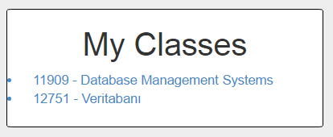

Parts Implemented by Pelin Hakverir
===================================
Class/CRN edition and class group pages are created by Pelin Hakverir.

Edit Classes
------------
The Lectures page can be accessed via the "Lectures" button on the navigation bar.

     Lectures page that users can edit the lectures and their own classes

On the left side of the Lectures page, which can be accessed via the "Lectures" button on the navigation bar, there is a column that allows you to edit your registered classes. Header of this column is "Edit Classes".

On top, there is a bar that user writes the CRN information of the class that he/she wants to join or leave. If the user enters a CRN that is not in the database, the message "The CRN information is not in the database" is printed on the page.

Under the addition&leaving class part, there is an update part that user can fix the CRN information of user's classes or just leave and add classes at the same time. Firstly, user enters the CRN of the class that wants to be deleted, and then the CRN of the class that wants to be added. If the CRN of the class that wants to be left is not in the database, the message "The old CRN information is not in the database". If the CRN of the class that wants to be added is not in the database, the message "The new CRN information is not in the database".

     Edit Classes column, which you can join or leave classes

My Classes
----------
In the middle of the Lectures page, user can see his/her classes are listed which he/she has registered.

     The list of the user's classes

Edit CRNs
---------
On the right side of the Lectures page, there is a column that allows you to edit the lecture informations. Header of this column is "Edit CRNs".

On the top of that column, the user can add a new lecture with the following informations: CRN, lecture name and lecturer name. If a user tries to add a lecture that has the same CRN with one of the lectures in the database, the message "The CRN information is already registered" is printed on the page.
When submitted, the information of the lecture is stored in the database. Users can join this class after implementation.

Below adding a lecture part, there is a part that users can delete classes with CRN information when they are closed.
When submitted, the information of the lecture is deleted from the database with all of the datas like lecture/lecturer name. After this deletion, the group of that class is also deleted but the posts can be reachable from timelines of the users who are registered to that class before. If there are students who are still registered to the class, the message "There are student(s) who are registered for the class!" is shown in the page and the lecture is not deleted. This prevents unwanted deletions.
If a class that is not in the database is trying to be deleted, the message "The CRN information is not registered yet" is printed on the page.

Under deletion, updating a lecture's name and lecturer is available. To update the lecture information, the CRN information should be entered.
If a class that is not in the database is trying to be updated, the message "The CRN information is not registered yet" is printed on the page.

Under the update, the users can search a specific CRN's lecture and lecturer name or list all the lectures in the database. If a user tries to search a lecture which is not registered in the database, the message "The CRN information is not in the database" is printed on the page.

     Edit CRNs column, which you can add/delete/update or search lectures.

Class Groups
------------
The list of the classes that the user has registered were being listed under My Classes block. By clicking on the lectures' name from the list, user can reach the groups of the classes.

     Accessing class groups via My Classes block

On the left side of the class groups, there is an information block which lists the class' CRN, lecture name and lecturer name informations.
On the right side of the page, user can see the list of users registered to that class, who are the user's classmates.
In the middle of the page, user can post to connect with his/her classmates and also see his/her classmates' posts.
If the user wants to delete or update a post of his/her own, he/she can click the blue button and go to post settings page.

     A class group which users can communicate with their classmates

Accessing Class Groups via Profile Page
---------------------------------------
On the user's profile page, there is a block which lists the CRN informations of the classes that the user has registered. By clicking on the CRNs, user can access the class groups directly.

     Users can access class groups from their profile pages directly