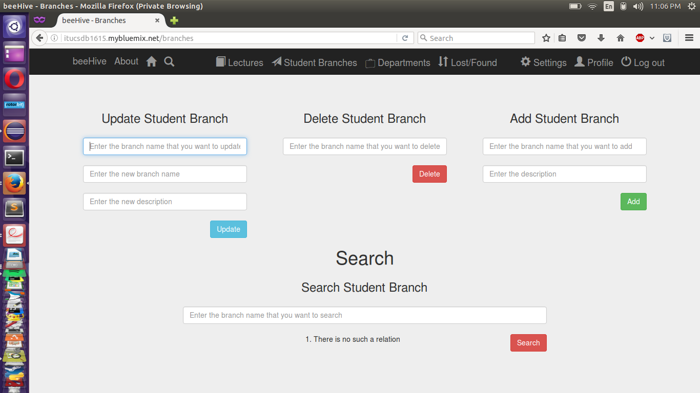
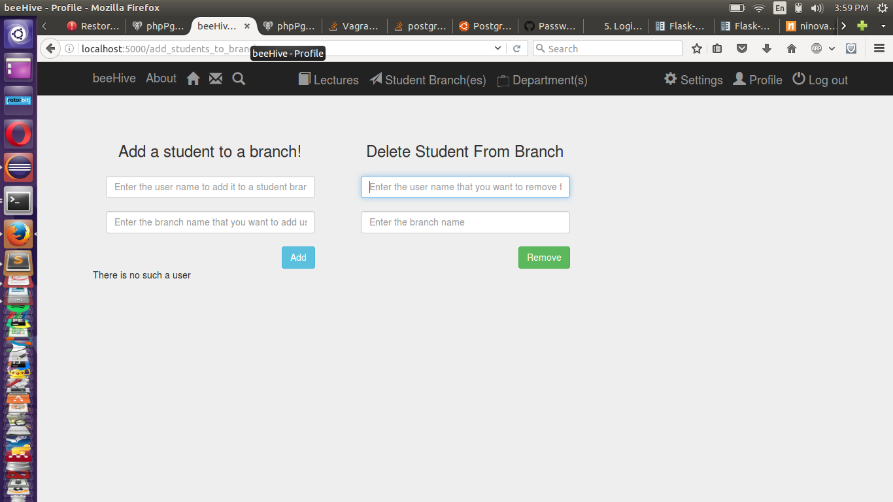
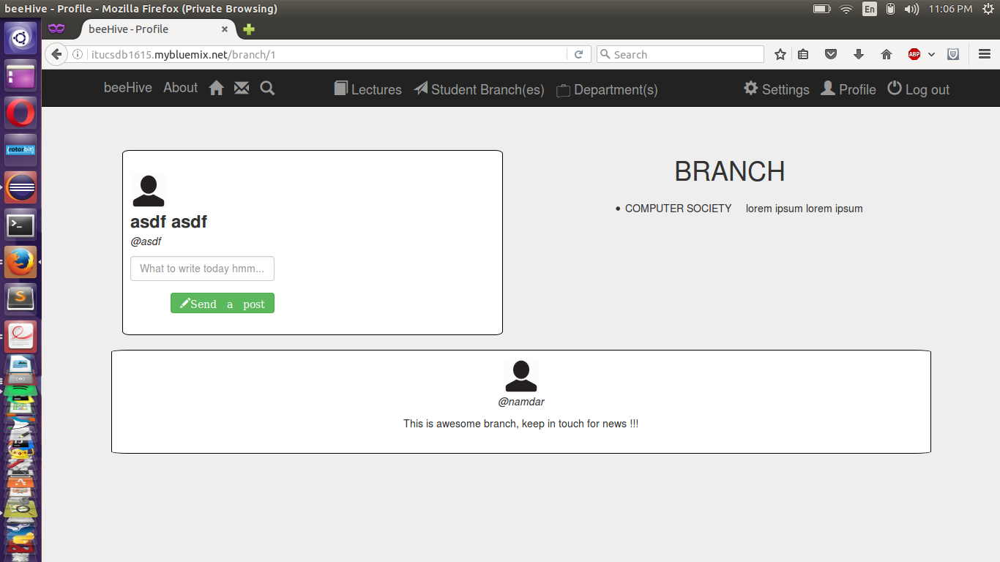
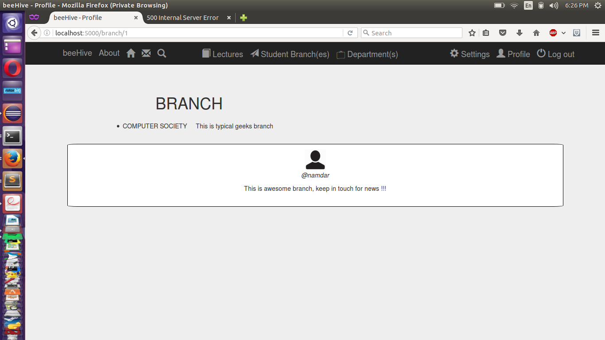

Parts Implemented by Yunus Emre Pala
====================================
add_student_to branch, individual branch pages, branch management pages,by using STUDENTBRACHES , BRANCHFEEDS,USER, STUDENTBRANCH_CASTING tables.

Manage Branches
---------------
There are limited number of student branches in ITU , maybe more than hundred but fixed size,so it does not makes sense to let users create student branches as they want, this would be result with many fake branches.
So instead of that only administrators can make CRUD operations on each branches.

In this page admins can change definitions or names of branches when it is necessery or required

Also there might be closed branch, then admins also delete that branch in this section.

For any new branch it should be added by admin manually again.

	  Management of branch pages

Add Students to Branches
------------------------

Well although only admins can make CRUD operations on branches ,all branch members can post in their branch pages that they registered for it.
So it is possible to add students to branches by using this page

	  users can be added or deleted to branches in this page.

Brach Pages
-----------

In beeHive it is possible to follow news from branches that you are interested in or to discover new ones.
If you are already registered to branch you can post anything you want to branch feedç

	  if user is seen as member of branch in database there will be post block that he/she can use for posting.

Or users are not seen as member of a branch they can see posts in those pages, but can not send post.

	  there is shared post for that branch

