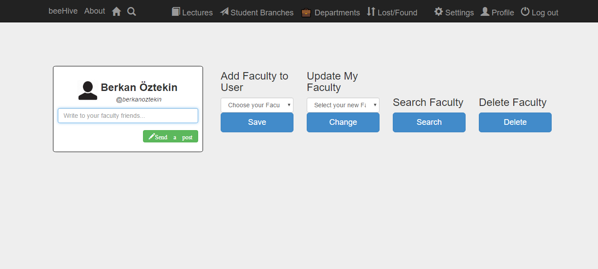
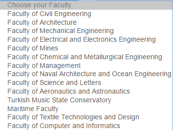
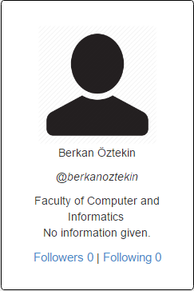
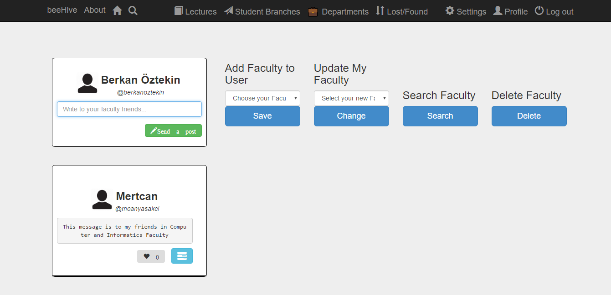
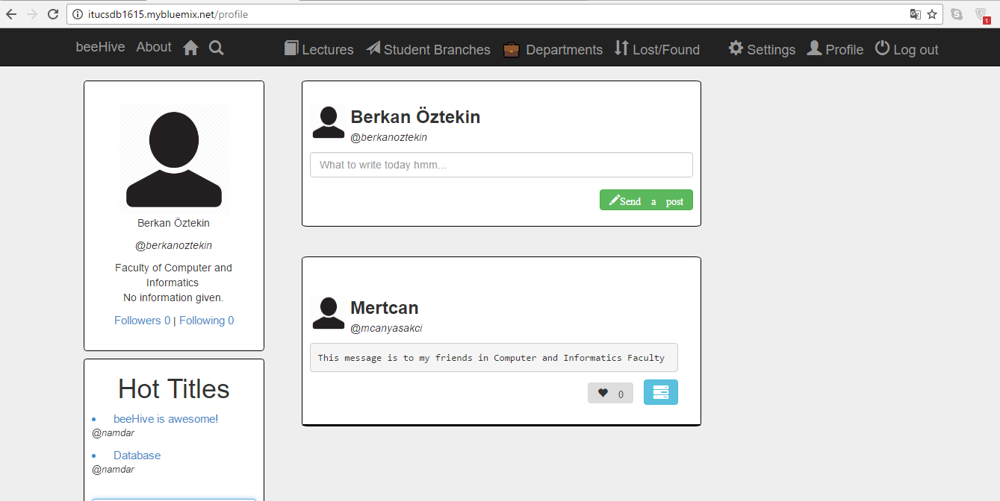

Parts Implemented by Berkan Öztekin
===================================
Faculty page is created by Berkan Öztekin. This page is related to FACULTYFEED, DEPARTMENTS and DEPARTMENTLIST tables.

Faculty Page
------------

Users can select,update, delete their faculty by using this page after logging in, and users can send messages to the other users who are in the same faculty with the sender.
You can see the general view of the faculty page below.

     General View of Faculty Page

     Name of Faculties on ITU

Faculty Name on Profile Page
----------------------------

After choosing  faculty, users can see their faculty name on their profile page.

     User can see their faculty on Profile Page

Users who are in the same faculty can send a message to each other by using the text box in faculty page.
For instance, Mertcan's and Berkan's account belong to Computer and Informatics Faculty, If one of them send a message by using text box in faculty page, the other one can see his message in faculty page.
You can see the images of given example below.

     Mertcan sent a message, and Berkan can see this message

Faculty Messages on Profile Page
--------------------------------

And lastly , messages which are sent by using text box in faculty page can also be seen on profile page.

     Users can see the faculty message on profile page
